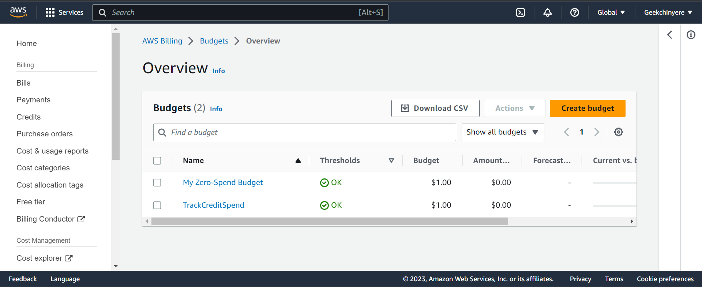

# Week 0 — Billing and Architecture

This marks the beginning of our AWS Free Cloud Project Bootcamp organized solely by our instructor Andrew Brown. *A start for an amazing ride*

- [Architecture Diagrams](#architecture-diagrams)
   -[Main Architectural Diagrams](#main-architectural-diagrams)
   -[Usage of the Types of Architectural Diagram](#usage-of-the-types-of-architectural-diagram)
   -[Creating Conceptual Design](#creating-conceptual-design)
   -[Creating Logical Diagram](#creating-logical-diagram)
- [IAM Users and Roles in AWS](#iam-users-and-roles-in-aws)
   -[How to Set up an IAM User](#how-to-set-up-an-iam-user)
   -[IAM Roles In AWS](#iam-roles-in-aws)
   -[Policies in AWS](#policies-in-aws)
- [AWS CloudTrail](#aws-cloudtrail)
   - [Create a Cloud Trail](#create-a-cloud-trail)
   -[AWS CloudWatch](#aws-cloudwatch)
- [Install and verify AWS CLI](#Install-and-verify-aws-cli)
   -[Install AWS Command-Line Tool](#install-aws-command-line-tool)
   -[Setting Environement Variables in Gitpod IDE](#setting-environement-variables-in-gitpod-ide)
- [AWS Billing](#aws-billing)
   -[Billing Alarms](#billing-alarms)
   -[Budgets Alarms](#budgets-alarms)
-[AWS Free Tier](#aws-free-tier)
   -[Benefits of using the AWS Free Tier](#benefits-of-using-the-aws-free-tier)
   -[Disadvantages of the AWS Free Tier](#disadvantages-of-the-aws-free-tier)
   -[ Tips for using the AWS Free Tier](#tips-for-using-the-aws-free-tier)
- [Homework Challenges](#Homework-challenges)

---

## Architecture Diagrams

Architectural diagrams are a clear representations of a software system's architecture, they are used to communicate the system's design, and to help developers understand how the system works.

### Main Architectural Diagrams:

- **Conceptual diagrams** provide a high-level overview of the system, they show the system's major components and how they interact.
- **Logical diagrams** shows the system's functionality in an expanded detail showing how the system's components interact, and how data flows through the system.

Each type of architectural diagram has its own purpose, and they are often used together to provide a complete picture of the system's architecture.

### Usage of the Types of Architectural Diagram

- **Conceptual diagrams** are used early in the development process, when the system's requirements are still being defined. They are a quick and easy way to communicate the overall idea of the system to stakeholders.
- **Logical diagrams** are used later in the development process, when the system's functionality is being designed. They are a more detailed way to communicate the system's design to developers.

Architectural diagrams are a valuable tool for communicating the design of a software system. 

### Creating Conceptual Design

Conceptual diagrams are often drawn on napkins or whiteboards, and can also be referred to as "napkin designs" the idea is to create a system that will allow users to share information and collaborate on projects. 


I Created Conceptual diagram of Crudder


Here is my [link of lucid chart](https://lucid.app/lucidchart/6933e61b-893c-419c-9e6b-6a643e716f22/edit?viewport_loc=-787%2C-49%2C2406%2C897%2C0_0&invitationId=inv_11635ac9-4931-4c0f-817a-a6dfed0f6b58)

---

### Creating Logical Diagram

Logical diagrams are more detailed than conceptual diagramms, it helps to communicate the system's design to software devs.

- **System architecture:** The system will be a three-tier architecture, consisting of a presentation layer, a business logic layer, and a data access layer.<br>
- **Data flow:** The data flow will be unidirectional, with users entering data into the presentation layer, which will then pass the data to the business logic layer for processing. 

This also effectively showcases the diverse components comprising the Cruddur product ecosystem.

**How create a Logic Architectural Diagram**

Here are different tools that can be used to create architectural diagrams;

- Lucidchart (Paid)
- draw.io (FREE)


I used **Lucidchart** in this week's own

- I Created a diagram of Crudder app


Here is my [link of lucid chart](https://lucid.app/lucidchart/1f56cd97-0de9-4e8b-b04a-466ef53dd988/edit?viewport_loc=-1283%2C-1876%2C4399%2C1641%2C0_0&invitationId=inv_bedbe3f8-d7aa-4586-8054-40722e6271a0)

---

## IAM Users and Roles in AWS

IAM users and roles are the strong foundations of AWS security, it is designed to allow you control who can access your AWS resources and what they can do with them.

- **Roles:** A set of permissions that can be assumed by entities like users or services, allowing them to perform specific actions on AWS resources.
- **Policies:** JSON documents that define what actions are allowed or denied on AWS resources, providing fine-grained control over access permissions.

IAM users can be given specific roles to access AWS resources, which are controlled through policies assigned (technically attached) to these roles.

### How to Set up an IAM User

An IAM user is an individual or application that uses AWS resources. To set up an IAM user, you need to:

- Create a user name
- Make a password for the user
- Choose the access type:
  - Programmatic access -> Allows the user to interact with AWS programmatically using APIs, SDKs, or CLI.
  - AWS Management Console access -> Allows the user to sign in to the AWS Management Console with a password.

In our case our type is *AWS Management Console access*  Below is a view of my created IAM

.png)


Once you have set up an IAM user, you can signin to AWS Management Console as that IAM user. 
1. Open the AWS Management Console in a web browser.
2. In the sign-in dialog box, select **IAM user**.
3. Enter the user name and password for the IAM user.
4. Click **Sign in**.

.png)

### IAM Roles In AWS

IAM (Identity and Access Management) roles in AWS are a way to manage permissions and access for AWS resources. They define a set of permissions that determine what actions users, services, or applications can perform on AWS resources. IAM roles are used to delegate access across AWS accounts, services, and resources securely.

1. Select the type of role you want to create.
2. Attach a policy to the role that grants the role the permissions it needs to access your AWS resources.
3. (Optional) Tag the role with metadata.

Some roles in IAM

.png)

### Policies in AWS

IAM roles have permissions policies attached to them, which define the actions that are allowed or denied on AWS resources. These policies are written in JSON format and specify the resources and conditions under which actions can be performed.

1. Go to the IAM console in the AWS Management Console.
2. In the navigation pane, select **Policies**.
3. Select the policy that you want to attach.
4. Click **Attach Policy**.
5. Select the role or user group that you want to attach the policy to.
6. Click **Attach**.

Overall list of policies after completion of this Bootcamp

.png)

---
## AWS CloudTrail

I AWS a cloudtrail refers to a marked or beaten path or track, often in a natural environment such as a forest, mountain, or wilderness area.

*AWS Cloud Trail is an auditing service that records AWS API calls and related events* 

**The data can be used to**
* Security Analysis
* Incident Response
* Audit logs and compliance
* Track user activity
* Troubleshoot issues

### Create a Cloud Trail

1. In AWS CloudTrail.
2. Click **CreateTrail**.
3. Enter a name for your trail.
4. Select the regions and accounts that you want to monitor.
5. Select the events that you want to log.
6. Choose a S3 bucket to store your Cloud Trail logs.
7. Click **Create**.

Events history in Cloudtrail

.png)

### AWS CloudWatch

AWS CloudWatch is a monitoring and observability service provided by Amazon Web Services (AWS) that helps you collect and track metrics, monitor logs, set alarms, and automatically react to changes in your AWS resources and applications. 

For example, in our case we worked more with log groups; CloudWatch Logs enables you to monitor, store, and analyze log data generated by your AWS resources and applications. You can stream logs from EC2 instances, Lambda functions, and other AWS services to CloudWatch Logs for real-time analysis and troubleshooting.

1. Go to the [CloudWatch console](https://console.aws.amazon.com/cloudwatch/).
2. In the CloudWatch dashboard, select "Logs" from the left navigation lane.
3. Click the "Create log group" button.
4. Enter a name for your log group in the "Log group name" field. This name should be unique within your AWS account.
5. Click on the "Create log group" button to create the log group.

An example of a cloud watch log group

.png)

---

## Install and verify AWS CLI

AWS CloudShell is a browser-based shell  you can use to interact with AWS services. Itenables you to access a command-line interface (CLI) directly from the AWS Management Console and gives you access to a pre-configured environment with common AWS tools and utilities, such as the AWS CLI, AWS SDKs, and popular programming languages like Python and Node.js. With AWS CloudShell, you can interact with AWS services, run commands, and automate tasks without the need to set up or manage your own local development environment.

**To use AWS CloudShell:**

1. Go to the [AWS CloudShell console](https://console.aws.amazon.com/cloudshell/).
2. Click the **Launch CloudShell** button.
3. A new tab will open in your browser with a pre-configured shell.
4. Type the following command while inside.

I ran

```bash
aws sts get-caller-identity
```
The output of the command to prove I am using this account:


### Install AWS Command-Line Tool

The AWS CLI is a command-line tool that allows you to interact with AWS services, this tool can be used to automate tasks, manage resources, and troubleshoot problems.

To install the AWS CLI, you can follow these steps:

1. Download the AWS CLI package from the [AWS website](https://aws.amazon.com/cli/)

```sh
curl "https://awscli.amazonaws.com/awscli-exe-linux-x86_64.zip" -o "awscliv2.zip"
```
2. Unzip the package.
```bash
unzip awscliv2.zip
```
3. Run the `install` script.

```bash
sudo ./aws/install
```

Once you have installed the AWS CLI, you can verify that it is installed by running the following command:

```bash
aws --version
```
```sh
gp env AWS_ACCOUNT_ID=$(aws sts get-caller-identity --query Account --output text)
```
The output of my CLI in my workspace account:

.png)

---

### Setting Environement Variables in Gitpod IDE


1. In its terminal, run the following commands

```sh
export AWS_ID=your_aws_id
export AWS_ACCESS_KEY_ID=your_access_key_id
export AWS_SECRET_ACCESS_KEY=your_secret_access_key
export AWS_DEFAULT_REGION=your_default_region
```

2.To use AWS CLI in Gitpod I have to save my environment variables in my Gitpod safely. I used these commands in my terminal

```sh
gp env  AWS_ID=your_aws_id
gp env AWS_ACCESS_KEY_ID=your_access_key_id
gp env AWS_SECRET_ACCESS_KEY=your_secret_access_key
gp AWS_DEFAULT_REGION=your_default_region
```

.png) 


---

## AWS Billing 

### Billing Alarms 

* I set up billing alarms using cloud watch.


.png)

.png)

### Budgets Alarms

I created two aws budget alarms

* In order to create the budget alarm:
- I Create SNS topic
- I Subscribe to SNS topic
- I Created Budget Alarm

* I used this as a vital instruction guide. [link](https://docs.aws.amazon.com/cli/latest/reference/sns/create-topic.html)

* To Subscribe SNS Topic, I attached an Email ID with these commands:

```
aws sns subscribe \
--topic-arn="arn:aws:sns:us-east-1a:2*ARN*808:BUDGET_TOPIC" \
--protocol=email \
--notification-endpoint=your_sns_details
```
![EMAIL] (https://github.com/Chinyere-nwalie/aws-bootcamp-cruddur-20A23/blob/main/journal/assets/Screenshot%20(134).png)


After creating billing alarms, I received an email below as proof


---

Proof of Budget alerts



.png)

.png)

.png)

.png)

---

## AWS Free Tier

To commence this bootcamp, I signed up for an AWS Free Tier Account, it's a great way to try out AWS services for free. The Free Tier offers a variety of services and it lasts for 12 months

This is my Free Tier Usage Limit Budget for the month of october NB:*when the bootcamp had commenced in febrauary i didn't take a screenshot*

.png)

To view details related to AWS Free Tier, visit the [AWS Free Tier website](https://aws.amazon.com/free).

### Benefits of using the AWS Free Tier 

1. You can try out AWS services without having to pay anything.
2. Learn how to use AWS services without having to worry about credits.
3. Build and test your applications with free tier account.

### Disadvantages of the AWS Free Tier

1. The Free Tier is limited to certain services and usage levels.
2. The Free Tier does not include all AWS services.
3. The Free Tier is not available to all customers.

### Tips for using the AWS Free Tier

1.  **Choose the right services.** Not all AWS services are available in the Free Tier, choose the eligible services that are most relevant to your project type.
2. **Track your usage.** The AWS Free Tier has usage limits, make sure you are not exceeding the limits.
3. **Plan for the future.** The Free Tier is not a permanent solution, ensure to plan how you will pay for AWS services when the Free Tier expires

---

## Homework Challenges

* AWSEventbridge

- I created a rule to hook up the Health Dashboard to SNS and send notification when there is a service health issue. I was able to accomplish this task through the instructions in this link [here.](https://docs.aws.amazon.com/health/latest/ug/cloudwatch-events-health.html)
   
 
   
- I opened a support ticket for my EC2 instance. I was able to accomplish this task through the instructions in this link [here](https://docs.aws.amazon.com/awssupport/latest/user/create-service-quota-increase.html)
  
 
    
* AWS Credits
- I received a $100 credit from the Mongodb AWS Marketplace event. 


Gitpod Credits

.png)


> Week 1 [App Containerization](week1.md)
